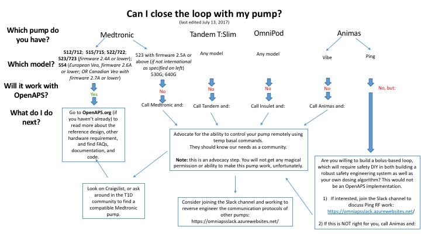

# Information about compatible insulin pumps

As you can see from the flowchart above, most of the commercial pumps currently available are not compatible with OpenAPS; only a small selection of older Medtronic pumps are compatible.  For those pumps which are not compatible, we suggest the advocacy option of calling the pump manufacturer and informing them of the need for availability of pumps for DIY closed looping systems.  Thus far, there has been not been a receptive pump company to these requests.  Omnipod, Animas, T-Slim, and newer Medtronic pumps are still not compatible.

Currently, only the following Medtronic MiniMed models allow us to remotely set temporary basal rate commands, which is required to do OpenAPS:

    512/712 (all firmware)
    515/715 (all firmware)
    522/722 (all firmware)
    523/723 (with firmware 2.4A or lower)
    554/754 (European Veo, with firmware 2.6A or lower; OR Canadian Veo with firmware 2.7A or lower)

NOTE: For European/WorldWide users who have access to a `DANA*R` insulin pump, you may be able to use AndroidAPS, which leverages OpenAPS's oref0 algorithm but allows you to interface using an Android phone and Bluetooth to communicate directly with the `DANA*R` pump. [See here for instructions and details related to AndroidAPS](https://github.com/MilosKozak/AndroidAPS).

## How to check pump firmware (check for absence of PC Connect)

The firmware version will briefly display after the initial count-up on a new battery insertion.  After the pump has been on for awhile, you can check firmware version by using the Esc button on the pump and scroll all the way to the bottom of the screen messages using the down arrow on pump. 

A double-check for pump compatibility is to look for the ABSENCE of PC connect in the pump menu.  Press the ACT button, scroll down to the the "Utilities" menu, and within the "Connect Devices" menu and look for a PC Connect option. If that is present, the pump will NOT work for looping. If it’s absent, the pump should be able to receive temp basal commands and be compatible.

If you have one of the above mentioned pumps, but it has buttons that do not work, use the instructions found on this [Imgur photo album](http://imgur.com/a/iOXAP) to repair your pump.  This repair is quite straight-forward and easy.

## Why do I need a certain pump firmware?

Due to changes in the firmware, the openaps tools are only able to function in-full on the above pump models. Security features were added after firmware v2.4 in the US that prevent making some remote adjustments via the decoded communications OpenAPS uses. For 512/712 pumps, certain commands like Read Settings, BG Targets and certain Read Basal Profile are not available, and requires creating a special files for the missing info to successfully run the loop ([Instructions for 512/712 users, click here](http://bit.ly/1itCsRl)).

If you are not based in the US, some later model pumps and firmware may be compatible as listed above. Check for PC Connect absence to determine compatibility.

One of the most frequently asked questions is "I have a 723 pump but it has version 2.5B software version.  Has anyone figured out a way to make newer model Medronic pumps compatible?  Like flash older version of software onto my 723 2.5B pump?"  The answer is "No.  The ability to downgrade software versions in the pumps does not exist.  It has been investigated and nobody has made any successful progress to that end."

## Tips for finding a compatible pump

If you need to acquire a compatible pump, check CraigsList or other sites like Medwow or talk to friends in your local community to see if there are any old pumps lying around in their closets gathering dust. [MedWow](http://www.medwow.com) is an eBay-like source for used pumps. [SearchTempest](http://www.searchtempest.com) is a great tool for searching Craigslist nationally all at once. In addition to searching for listings, consider posting an offer to Craigslist or ask around local community groups.

If you're buying a pump online, we recommend you ask the seller to confirm the firmware version of the pump. (You may also want to consider asking for a video of the pump with working functionality before purchasing.)

