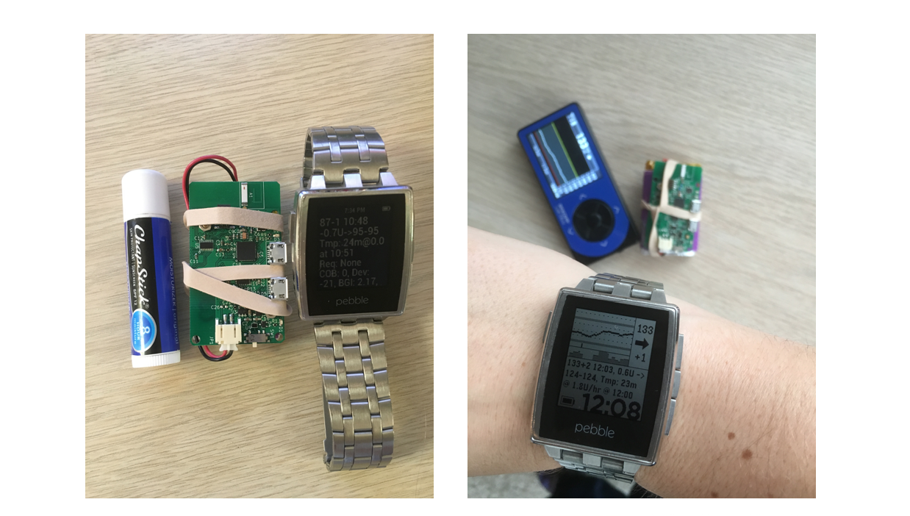

# Frequently Asked Questions

## What is a Closed Loop?

In general, a "closed loop" system for treatment of diabetes is considered to
be one in which insulin dosing "and in some cases glucagon dosing" is
partially or completely automated. This is in contrast to an "open loop"
system, where the user evaluates the inputs and manually instructs the insulin
pump to dose a specific amount. In both cases, the goal is to maintain blood
glucose within the desired range through adjusting hormone doses.

There are numerous different types of closed loop systems, ranging from simple
basal suspend systems designed to mitigate extreme hypoglycemia to dual
hormone, fully automated systems. 

\#OpenAPS is focused on a single-hormone hybrid closed-loop system. This is a
system that uses only insulin (no glucagon) and still requires user input for
mealtime insulin. For background on #OpenAPS, review the [\#OpenAPS Reference
Design](https://openaps.org/reference-design/)
page.

## What does an OpenAPS closed loop look like?

There are numerous variations of OpenAPS setups. 

This particular setup below is an original setup, similar to what was first used to close the loop by DIYers in late 2014/early 2015. The picture below shows the key components—namely, a continuous glucose monitor, an insulin pump, a method for communicating with the pump (here, a CareLink USB stick), and a controller (here, a Raspberry Pi). Also shown is a Pebble watch, which can be used for monitoring the status of the OpenAPS. Not shown is the power supply (off-screen) and a way to interact with and program the Raspberry Pi, typically a computer or smartphone.

The most common setup as of late 2015/early 2016 has evolved to be a smaller rig, with similar components. The Edison chip is the mini-computer, and the Explorer Board hosts it along with the radio stick to communicate with the CGM and pump.

For more details on the exact hardware required to build an OpenAPS, see the
[Hardware](../walkthrough/phase-0/hardware/hardware.md) section.

