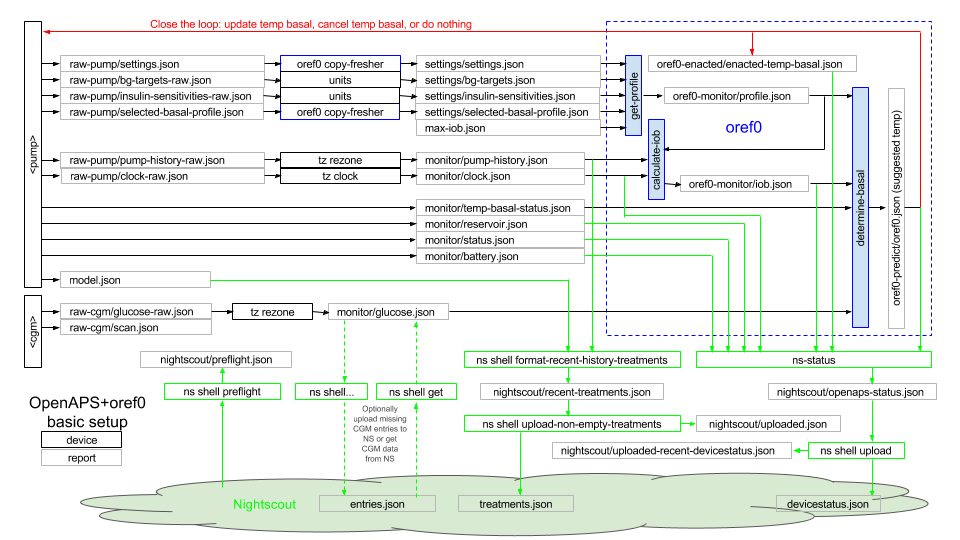

# Phase 1: Logging, Cleaning, and Analyzing Your Data

Phase 1 focuses on accessing, logging, cleaning up, and analyzing data from the pump and CGM. Data fidelity is extremely important, especially when dosing is being considered. Take the time to review what the openaps tools are outputting and carefully compare the logs against your own CareLink and CGM reports.

By the end of this phase, you should have Nightscout set up; have alerts configured to know whether your system is looping or not; and be analyzing your existing pump or CGM data.

As you go through the seting up your system, you may refer to the following diagram that shows a basic system setup with openaps tools used to collect and format pump and CGM data, and an open reference implementation of OpenAPS design referred to as oref0 is used to calculate suggested temp basals. The diagram shows openaps devices, openaps reports, and system dependences, as well as ways the system can be integrated with Nightscout. In Phase 1, you will setup pump and cgm devices and use them to collect pump and cgm data in the form or openaps reports. In Phases 2 and 3, you will setup oref0 devices, reports and aliases for an open-loop system. Closing to loop is addressed in Phases 4 and 5, while Phase 6 introduces some more advanced system features.

